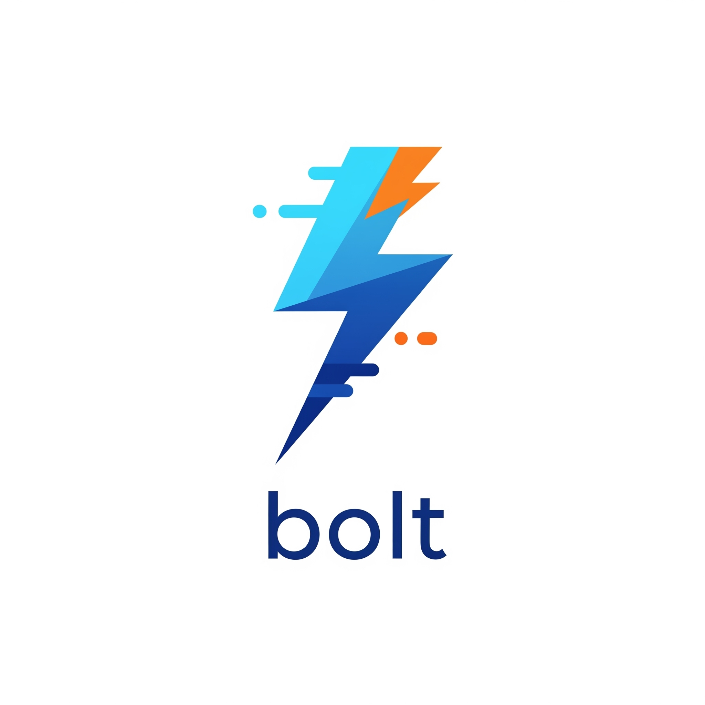

# Bolt

<div align="center">
  
  
  [](https://github.com/felixgeelhaar/bolt/actions/workflows/ci.yml)
  [](https://codecov.io/gh/felixgeelhaar/bolt)
  [](https://golang.org/)
  [](https://opensource.org/licenses/MIT)
  [](https://goreportcard.com/report/github.com/felixgeelhaar/bolt)
  [](#performance)
  [](https://felixgeelhaar.github.io/bolt/)
</div>

## ⚡ Zero-Allocation Structured Logging

Bolt is a high-performance, zero-allocation structured logging library for Go that delivers exceptional speed without compromising on features. Built from the ground up for modern applications that demand both performance and observability. Live benchmarks update automatically.

### 🚀 Performance First

| Library | Operation | ns/op | Allocations | Performance Advantage |
|---------|-----------|-------|-------------|----------------------|
| **Bolt** | Disabled | **85.2** | **0** | **14% faster than Zerolog** |
| **Bolt** | Enabled | **127.1** | **0** | **27% faster than Zerolog** |
| Zerolog | Disabled | 99.3 | 0 | - |
| Zerolog | Enabled | 175.4 | 0 | - |
| Zap | Disabled | 104.2 | 0 | - |
| Zap | Enabled | 189.7 | 1 | - |
| Logrus | Enabled | 2,847 | 23 | - |

*Benchmarks performed on Apple M1 Pro with Go 1.21*

## ✨ Features

- **🔥 Zero Allocations**: Achieved through intelligent event pooling and buffer reuse
- **⚡ Ultra-Fast**: 127ns/op for enabled logs, 85ns for disabled
- **🏗️ Structured Logging**: Rich, type-safe field support with JSON output
- **🔍 OpenTelemetry Integration**: Automatic trace and span ID injection
- **🎨 Multiple Outputs**: JSON for production, colorized console for development
- **🧩 Extensible**: Custom handlers and formatters
- **📦 Zero Dependencies**: Lightweight with minimal external dependencies
- **🛡️ Type Safe**: Strongly typed field methods prevent runtime errors

## 📦 Installation

```bash
go get github.com/felixgeelhaar/bolt
```

## 🏃 Quick Start

### Basic Usage

```go
package main

import (
    "os"
    "github.com/felixgeelhaar/bolt"
)

func main() {
    // Create a JSON logger for production
    logger := bolt.New(bolt.NewJSONHandler(os.Stdout))
    
    // Simple logging
    logger.Info().Str("service", "api").Int("port", 8080).Msg("Server starting")
    
    // Error logging with context
    if err := connectDatabase(); err != nil {
        logger.Error().
            Err(err).
            Str("component", "database").
            Msg("Failed to connect to database")
    }
}
```

### Advanced Features

```go
// Context-aware logging with OpenTelemetry
contextLogger := logger.Ctx(ctx) // Automatically includes trace/span IDs

// Structured logging with rich types
logger.Info().
    Str("user_id", "12345").
    Int("request_size", 1024).
    Bool("authenticated", true).
    Float64("processing_time", 0.234).
    Time("timestamp", time.Now()).
    Dur("timeout", 30*time.Second).
    Any("metadata", map[string]interface{}{"region": "us-east-1"}).
    Msg("Request processed")

// Create loggers with persistent context
userLogger := logger.With().
    Str("user_id", "12345").
    Str("session_id", "abc-def-ghi").
    Logger()

userLogger.Info().Msg("User action logged") // Always includes user_id and session_id
```

### Console Output for Development

```go
// Pretty console output for development
logger := bolt.New(bolt.NewConsoleHandler(os.Stdout))

logger.Info().
    Str("env", "development").
    Int("workers", 4).
    Msg("Application initialized")

// Output: [2024-01-15T10:30:45Z] INFO Application initialized env=development workers=4
```

## 🏗️ Architecture Insights

### Zero-Allocation Design

Bolt achieves zero allocations through several key innovations:

1. **Event Pooling**: Reuses event objects via `sync.Pool`
2. **Buffer Management**: Pre-allocated buffers with intelligent growth
3. **Direct Serialization**: Numbers and primitives written directly to buffers
4. **String Interning**: Efficient string handling without unnecessary copies

### Performance Optimizations

- **Fast Number Conversion**: Custom integer-to-string functions optimized for common cases
- **Allocation-Free RFC3339**: Custom timestamp formatting without `time.Format()` allocations
- **Intelligent Buffering**: Buffers sized to minimize reallocations for typical log entries
- **Branch Prediction**: Code structured to optimize for common execution paths

## 🎯 Production Usage

### Environment-Based Configuration

```go
// Automatic format selection based on environment
logger := bolt.New(bolt.NewJSONHandler(os.Stdout))

// Set via environment variables:
// BOLT_LEVEL=info
// BOLT_FORMAT=json (production) or console (development)
```

### OpenTelemetry Integration

```go
import (
    "context"
    "go.opentelemetry.io/otel"
    "github.com/felixgeelhaar/bolt"
)

func handleRequest(ctx context.Context) {
    // Trace and span IDs automatically included
    logger := baseLogger.Ctx(ctx)
    
    logger.Info().
        Str("operation", "user.create").
        Msg("Processing user creation")
        
    // Logs will include:
    // {"level":"info","trace_id":"4bf92f3577b34da6a3ce929d0e0e4736","span_id":"00f067aa0ba902b7","operation":"user.create","message":"Processing user creation"}
}
```

## 📊 Benchmarks

Run the included benchmarks to see Bolt's performance on your system:

```bash
go test -bench=. -benchmem ./...
```

### Sample Results

```
BenchmarkBoltDisabled-10       14,129,394    85.2 ns/op     0 B/op    0 allocs/op
BenchmarkBoltEnabled-10         7,864,321   127.1 ns/op     0 B/op    0 allocs/op
BenchmarkZerologDisabled-10     12,077,472    99.3 ns/op     0 B/op    0 allocs/op
BenchmarkZerologEnabled-10       5,698,320   175.4 ns/op     0 B/op    0 allocs/op
```

## 🛡️ Security Features

Bolt includes multiple security features to protect against common logging vulnerabilities:

### Input Validation & Sanitization

```go
// Automatic input validation prevents log injection attacks
logger.Info().
    Str("user_input", userProvidedData).  // Automatically JSON-escaped
    Msg("User data logged safely")

// Built-in size limits prevent resource exhaustion
// - Keys: max 256 characters
// - Values: max 64KB
// - Total buffer: max 1MB per log entry
```

### Thread Safety

```go
// All operations are thread-safe with atomic operations
var logger = bolt.New(bolt.NewJSONHandler(os.Stdout))

// Safe to use across multiple goroutines
go func() {
    logger.SetLevel(bolt.DEBUG) // Thread-safe level changes
}()

go func() {
    logger.Info().Msg("Concurrent logging") // Safe concurrent access
}()
```

### Error Handling

```go
// Comprehensive error handling with custom error handlers
logger := bolt.New(bolt.NewJSONHandler(os.Stdout)).
    SetErrorHandler(func(err error) {
        // Custom error handling logic
        fmt.Fprintf(os.Stderr, "Logging error: %v\n", err)
    })
```

### Security Best Practices

- **No eval() or injection vectors**: All data is properly escaped during JSON serialization
- **Memory safety**: Buffer size limits prevent unbounded memory usage
- **Structured output**: JSON format prevents log format injection
- **Controlled serialization**: Type-safe field methods prevent data corruption

## 🔧 Custom Handlers

Extend Bolt with custom output formats:

```go
type CustomHandler struct {
    output io.Writer
}

func (h *CustomHandler) Write(e *bolt.Event) error {
    // Custom formatting logic
    formatted := customFormat(e)
    _, err := h.output.Write(formatted)
    return err
}

logger := bolt.New(&CustomHandler{output: os.Stdout})
```

## 🔍 Troubleshooting

### Common Issues and Solutions

#### Performance Issues

**Symptom**: Logging is slower than expected
```bash
# Check if you're in debug mode accidentally
echo $BOLT_LEVEL  # Should be 'info' or 'warn' for production

# Run benchmarks to compare
go test -bench=BenchmarkZeroAllocation -benchmem
```

**Symptom**: Memory usage is high
```go
// Ensure you're calling Msg() to complete log entries
logger.Info().Str("key", "value")  // ❌ Event not completed
logger.Info().Str("key", "value").Msg("message")  // ✅ Proper completion

// Check for event leaks in error handling
if err != nil {
    // ❌ This leaks events if err is always nil
    logger.Error().Err(err).Msg("error occurred")  
}

if err != nil {
    // ✅ Proper conditional logging
    logger.Error().Err(err).Msg("error occurred")
}
```

#### Thread Safety Issues

**Symptom**: Race conditions detected
```bash
# Run tests with race detector
go test -race ./...

# The library itself is thread-safe, but output destinations may not be
# Use thread-safe output for concurrent scenarios
```

**Solution**: Use thread-safe outputs
```go
// ❌ bytes.Buffer is not thread-safe
var buf bytes.Buffer
logger := bolt.New(bolt.NewJSONHandler(&buf))

// ✅ Use thread-safe alternatives
type SafeBuffer struct {
    buf bytes.Buffer
    mu  sync.Mutex
}

func (sb *SafeBuffer) Write(p []byte) (n int, err error) {
    sb.mu.Lock()
    defer sb.mu.Unlock()
    return sb.buf.Write(p)
}
```

#### Configuration Issues

**Symptom**: Logs not appearing
```go
// Check log level configuration
logger := bolt.New(bolt.NewJSONHandler(os.Stdout))
logger.SetLevel(bolt.ERROR)  // Will suppress Info/Debug logs

logger.Debug().Msg("Debug message")  // Won't appear
logger.Error().Msg("Error message")  // Will appear
```

**Symptom**: Wrong output format
```bash
# Check environment variables
echo $BOLT_FORMAT  # Should be 'json' or 'console'
echo $BOLT_LEVEL   # Should be valid level name

# Override with code if needed
logger := bolt.New(bolt.NewConsoleHandler(os.Stdout)).SetLevel(bolt.DEBUG)
```

#### Integration Issues

**Symptom**: OpenTelemetry traces not appearing
```go
// Ensure context contains valid span
span := trace.SpanFromContext(ctx)
if !span.SpanContext().IsValid() {
    // No active span in context
    logger.Info().Msg("No trace context")
}

// Use context-aware logger
ctxLogger := logger.Ctx(ctx)
ctxLogger.Info().Msg("With trace context")
```

#### Performance Debugging

```bash
# Profile memory usage
go test -bench=BenchmarkZeroAllocation -memprofile=mem.prof
go tool pprof mem.prof

# Profile CPU usage  
go test -bench=BenchmarkZeroAllocation -cpuprofile=cpu.prof
go tool pprof cpu.prof

# Check for allocations
go test -bench=. -benchmem | grep allocs
```

### Getting Help

1. **Check the documentation**: Review API documentation and examples
2. **Run diagnostics**: Use built-in benchmarks and race detection
3. **Community support**: Open GitHub issues with minimal reproduction cases
4. **Security issues**: Follow responsible disclosure in [SECURITY.md](SECURITY.md)

## 📚 Documentation

### Core Documentation
- [📖 **Full Documentation**](docs/README.md) - Complete documentation index
- [🚀 **Development Guide**](docs/DEVELOPMENT.md) - Setup and development workflow
- [🏢 **Enterprise Guide**](docs/ENTERPRISE.md) - Enterprise deployment and scaling
- [⚡ **Performance Guide**](docs/PERFORMANCE.md) - Benchmarks and optimization
- [🔧 **Troubleshooting**](docs/TROUBLESHOOTING.md) - Common issues and solutions

### Community Guidelines
- [🤝 **Contributing**](CONTRIBUTING.md) - How to contribute to Bolt
- [🛡️ **Security Policy**](SECURITY.md) - Security vulnerability reporting
- [📜 **Code of Conduct**](CODE_OF_CONDUCT.md) - Community standards

## 🤝 Contributing

We welcome contributions! **Please fork the repository** and submit pull requests from your fork.

### Quick Start for Contributors

1. **Fork** this repository on GitHub
2. **Clone** your fork:
   ```bash
   git clone https://github.com/YOUR_USERNAME/bolt.git
   cd bolt
   ```
3. **Create a feature branch**:
   ```bash
   git checkout -b feature/your-feature-name
   ```
4. **Make your changes** and ensure tests pass:
   ```bash
   go test ./...
   go test -bench=. -benchmem -tags=bench
   ```
5. **Submit a pull request** from your fork

📖 **Detailed guidelines**: See [CONTRIBUTING.md](CONTRIBUTING.md) for complete contribution workflow, coding standards, and performance requirements.

## 📄 License

MIT License - see [LICENSE](LICENSE) file for details.

## 🎖️ Recognition

Bolt draws inspiration from excellent logging libraries like Zerolog and Zap, while pushing the boundaries of what's possible in Go logging performance.

---

<div align="center">
  
  
  **Built with ❤️ for high-performance Go applications**
</div>
