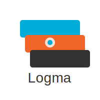

# Logma : High-Performance, Zero-Allocation Structured Logging for Go

Logma is a new Go logging library designed to solve the "Logger's Trilemma" by balancing uncompromising performance, superior developer experience, and first-class observability.

## Features

- **Zero-Allocation Core:** Achieves performance on par with `zerolog` and `zap` for enabled log levels.
- **Intuitive, Chainable API:** A simple and fluent API for adding structured context.
- **"Magic" Defaults:** Automatically configures output format (console or JSON) based on TTY detection, with environment variable overrides.
- **OpenTelemetry Integration:** Seamlessly integrates with OpenTelemetry to include `trace_id` and `span_id` in log output.
- **Configurable Log Levels:** Control log verbosity via environment variables or programmatically.

## Installation

```bash
go get github.com/your-username/logma
```

## Usage

### Basic Logging

```go
package main

import "github.com/your-username/logma"

func main() {
	logma.Info().Msg("Hello, Logma!")
}
```

### Structured Logging

```go
package main

import "github.com/your-username/logma"

func main() {
	logma.Info().
		Str("user_id", "123").
		Int("order_id", 456).
		Msg("User placed an order")
}
```

### Error Logging

```go
package main

import (
	"errors"
	"github.com/your-username/logma"
)

func main() {
	err := errors.New("something went wrong")
	logma.Error().Err(err).Msg("Failed to process request")
}
```

### Sub-Loggers with Context

```go
package main

import "github.com/your-username/logma"

func main() {
	requestLogger := logma.Info().Str("request_id", "abc-123").Logger()
	requestLogger.Info().Msg("Starting request processing")
	requestLogger.Warn().Str("step", "validation").Msg("Validation failed")
}
```

### OpenTelemetry Integration

```go
package main

import (
	"context"
	"github.com/your-username/logma"

	"go.opentelemetry.io/otel"
	"go.opentelemetry.io/otel/trace"
)

func main() {
	// Assume a tracer is configured and available
	tracer := otel.Tracer("my-app")

	ctx, span := tracer.Start(context.Background(), "my-operation")
	defer span.End()

	logma.Ctx(ctx).Info().Msg("Operation started with trace")
}
```

### Configuration

Logma can be configured via environment variables:

- `LOGMA_FORMAT`: Set to `json` for JSON output or `console` for human-readable console output. If unset, Logma automatically detects if it's running in a TTY.
- `LOGMA_LEVEL`: Set to `trace`, `debug`, `info`, `warn`, `error`, or `fatal` to control the minimum log level.

## Benchmarks

(To be generated after running `go test -bench=. -benchmem`)

## Contributing

Contributions are welcome! Please see the `CONTRIBUTING.md` for guidelines.

## License

This project is licensed under the MIT License.
