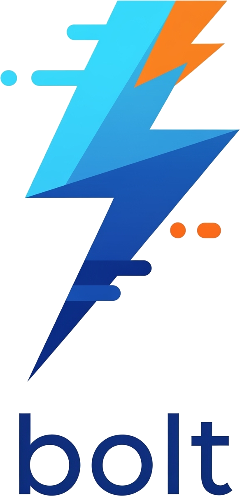

# Bolt

<div align="center">
  

  Zero-allocation `slog.Handler` for Go with first-class OpenTelemetry.

  [](https://github.com/felixgeelhaar/bolt/actions/workflows/ci.yml)
  [](https://github.com/felixgeelhaar/bolt/actions/workflows/nox.yml)
  [](https://codecov.io/gh/felixgeelhaar/bolt)
  [](https://pkg.go.dev/github.com/felixgeelhaar/bolt)
  [](https://goreportcard.com/report/github.com/felixgeelhaar/bolt)
  [](https://opensource.org/licenses/MIT)
</div>

## What it is

Bolt is a high-performance structured logging library for Go. It ships
two ways to use it:

1. As a stdlib `slog.Handler` — drop into any project that already uses
   `log/slog` and immediately get zero-allocation JSON output with
   correct group nesting, conformance-tested against
   `testing/slogtest.TestHandler`.
2. As a chained-builder API for hot paths where every nanosecond and
   allocation matters: `logger.Info().Str("k", v).Int("n", 42).Msg("…")`.

Both modes share the same encoder.

## Why bolt vs slog / zerolog / zap

A focused decision tree, not a feature shootout.

| You want… | Pick |
|---|---|
| The standard library API, no third-party dependency, no perf budget. | `log/slog` (stdlib) |
| Zero-alloc speed, slog ergonomics, **and** first-class OTel trace/span injection. | **bolt** |
| The `zerolog`-style chained API with the smallest production diff and a clear migration path from existing zerolog code. | **bolt** + `docs/how-to/migrate-from-zerolog.md` |
| `zap`'s typed-constructor API. | bolt's chained API; see `docs/how-to/migrate-from-zap.md` |

Bolt is **not** trying to win a single-digit-nanosecond benchmark
shootout. It's trying to be the slog handler you can ship into a
production Go service without giving up structured perf, OTel
correlation, or the slog ergonomics other teams already learned.

## Install

```bash
go get github.com/felixgeelhaar/bolt
```

Requires Go 1.24 or newer.

## Quick start

### As a `slog.Handler` (recommended)

```go
package main

import (
    "log/slog"
    "os"

    "github.com/felixgeelhaar/bolt"
)

func main() {
    logger := slog.New(bolt.NewSlogHandler(os.Stdout, nil))
    slog.SetDefault(logger)

    slog.Info("server starting", "service", "api", "port", 8080)
}
```

`bolt.NewSlogHandler` passes the standard
`testing/slogtest.TestHandler` conformance suite — `WithGroup`,
`WithAttrs` scoping, empty-group elision, `LogValuer` resolution all
work.

### As a chained-builder logger (hot paths)

```go
package main

import (
    "os"

    "github.com/felixgeelhaar/bolt"
)

func main() {
    log := bolt.New(bolt.NewJSONHandler(os.Stdout))

    log.Info().
        Str("service", "api").
        Int("port", 8080).
        Msg("server starting")
}
```

The chained API allocates zero bytes per log on the hot path. `Msg(…)`
is the terminator — forgetting it silently drops the event (a `go vet`
analyser is on the roadmap).

### OpenTelemetry trace/span correlation

```go
import "github.com/felixgeelhaar/bolt"

// Anywhere you have a context.Context:
log := bolt.New(bolt.NewJSONHandler(os.Stdout))
log.Ctx(ctx).Info().Msg("processing")
// → {"level":"info","trace_id":"…","span_id":"…","message":"processing"}
```

`Ctx(ctx)` returns a logger that automatically attaches the active
trace and span IDs from the context. No manual extraction.

## Migrating

Concrete side-by-side guides with API mapping tables, worked examples,
and honest "when not to migrate" notes:

- [`docs/how-to/migrate-from-slog.md`](./docs/how-to/migrate-from-slog.md)
- [`docs/how-to/migrate-from-zerolog.md`](./docs/how-to/migrate-from-zerolog.md)
- [`docs/how-to/migrate-from-zap.md`](./docs/how-to/migrate-from-zap.md)

## Field types

The chained API ships zero-allocation builders for the common types.
Full reference on [`pkg.go.dev`][godoc]; this is a short tour.

```go
log.Info().
    Str("user_id", "u-123").
    Int("status", 200).
    Bool("authenticated", true).
    Float64("latency_ms", 0.234).
    Time("at", time.Now()).
    Dur("timeout", 30*time.Second).
    Err(err).
    Stringer("addr", myNetAddr).
    Ints("user_ids", []int{1, 2, 3}).
    Strs("roles", []string{"admin", "editor"}).
    IPAddr("client", net.IPv4(192, 168, 1, 100)).
    Dict("request", func(d *bolt.Event) {
        d.Str("method", "POST").Int("status", 201)
    }).
    Msg("request handled")
```

`Any(key, v)` falls back to `encoding/json` reflection — convenient,
not zero-alloc.

[godoc]: https://pkg.go.dev/github.com/felixgeelhaar/bolt

## Logger composition

```go
// Pre-bind context that every log line should include.
sub := log.With().
    Str("service", "auth").
    Str("version", "v1.2.3").
    Logger()

sub.Info().Str("user", uid).Msg("login")
// → includes service, version, user every time
```

## Hooks and sampling

Two hook interfaces are available: a simple level+message `Hook` and a
field-aware `EventHook` for use cases like redaction, sensitive-content
gating, and cost accounting.

```go
// Simple hook: sees level + message only. Returning false drops it.
type metricsHook struct{}
func (h *metricsHook) Run(level bolt.Level, msg string) bool {
    metrics.IncrementLogCounter(level.String())
    return true
}
log.AddHook(&metricsHook{})

// Field-aware EventHook: receives the *Event mid-build.
type denySensitiveHook struct{}
func (h *denySensitiveHook) Run(e *bolt.Event, _ string) bool {
    allow := true
    e.WalkFields(func(key, _ []byte) bool {
        if string(key) == "password" || string(key) == "ssn" {
            allow = false
            return false // stop walking
        }
        return true
    })
    return allow
}
log.AddEventHook(&denySensitiveHook{})

// Built-in: keep 1 of every N events at the same level.
log.AddHook(bolt.NewSampleHook(100))
```

`EventHook` accessors:

- `e.Level()` — the event's log level
- `e.Buffer()` — read-only view of the in-flight JSON (do not mutate)
- `e.WalkFields(fn)` — iterate already-encoded `(key, value)` pairs

EventHooks may also add fields by calling the regular `e.Str(...)`,
`e.Int(...)` etc. methods. They run after every legacy `Hook` succeeds;
if any legacy hook returns false, EventHooks are skipped.

## Multi-output

```go
log := bolt.New(bolt.MultiHandler(
    bolt.NewJSONHandler(logFile),       // structured to file
    bolt.NewConsoleHandler(os.Stderr),  // colourised to terminal
))
```

## Console output for development

```go
log := bolt.New(bolt.NewConsoleHandler(os.Stdout))
log.Info().Str("env", "development").Int("workers", 4).Msg("ready")
// → INFO[2026-05-09T10:30:45Z] ready env=development workers=4
```

## Production tips (`<details>`)

<details>
<summary><strong>Levels and runtime configuration</strong></summary>

```go
log := bolt.New(bolt.NewJSONHandler(os.Stdout)).SetLevel(bolt.LevelInfo)

// Environment overrides:
//   BOLT_LEVEL  = trace | debug | info | warn | error | fatal
//   BOLT_FORMAT = json | console
```

The slog-style aliases (`bolt.LevelInfo`, `LevelError`, …) and the
SCREAMING_CASE forms (`bolt.INFO`, `ERROR`, …) are interchangeable.

</details>

<details>
<summary><strong>Thread-safety contract</strong></summary>

`JSONHandler`, `ConsoleHandler`, and `SlogHandler` all serialise writes
internally via `sync.Mutex`, so a single handler is safe for concurrent
use across goroutines. Custom handlers are responsible for their own
synchronisation.

</details>

<details>
<summary><strong>Fatal semantics</strong></summary>

`logger.Fatal()` writes the record and then calls `os.Exit(1)`,
matching `zap`, `zerolog`, `logrus`, and `slog` ecosystem norms. To
test code paths that emit Fatal records without terminating the test
binary, override the unexported `exitFunc` package variable (see
`fatal_test.go` for the pattern).

</details>

<details>
<summary><strong>Stdlib log bridge</strong></summary>

```go
w := bolt.NewLevelWriter(log, bolt.LevelError)
stdlog := log.New(w, "", 0)
stdlog.Print("legacy error path") // → bolt ERROR
```

</details>

## Examples

Each `examples/` subdirectory is a standalone Go module so you can
clone, `cd` into one, and `go run .`. CI builds every example listed
on every PR.

| Example | What it shows |
|---|---|
| `rest-api/` | HTTP service with structured access logs |
| `grpc-service/` | gRPC server with structured request/response logs |
| `microservices/http-middleware/` | Middleware-style HTTP logging with correlation IDs |
| `microservices/grpc-interceptors/` | gRPC interceptors (requires regenerating proto stubs) |
| `observability/opentelemetry/` | OTel tracing + Prometheus metrics + bolt log correlation |
| `batch-processor/` | Worker-pool / fan-out batching with sampling |

See [`examples/README.md`](./examples/README.md) for the full table and
the roadmap of patterns under consideration.

## Roadmap and governance

- [`ROADMAP.md`](./ROADMAP.md) — current themes (trust, positioning,
  migrator ergonomics, production correctness, supply-chain hardness),
  P0–P4 task table, and explicitly out-of-scope items.
- [`SECURITY.md`](./SECURITY.md) — vulnerability reporting and
  response-time SLAs (solo maintainer, MIT, best-effort).
- [`ADOPTERS.md`](./ADOPTERS.md) — list of organisations using bolt;
  PRs welcome.
- [`CHANGELOG.md`](./CHANGELOG.md) — release notes.

## Contributing

Issues and PRs welcome. See `CONTRIBUTING.md` for the workflow. The
short version: open an issue first for non-trivial changes,
conventional-commits format for messages, signed commits to `main`.

## License

MIT. See [`LICENSE`](./LICENSE).
